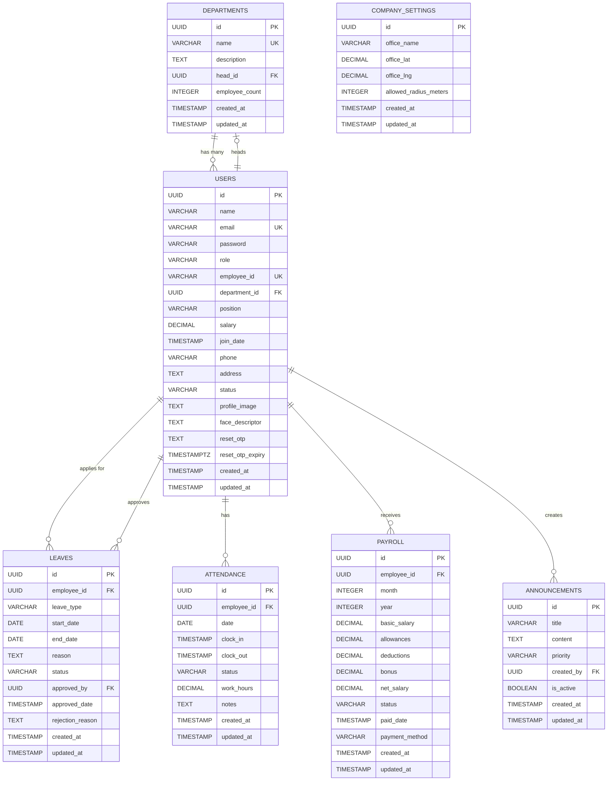

# PayrollPro — Database Schema & ER Diagram

## 📊 Entity Relationship Diagram



---

## 📋 Table Schemas

### 1. DEPARTMENTS

| Column | Type | Constraints | Description |
|--------|------|-------------|-------------|
| id | UUID | PK, DEFAULT uuid_generate_v4() | Primary key |
| name | VARCHAR(255) | UNIQUE, NOT NULL | Department name |
| description | TEXT | | Department description |
| head_id | UUID | FK → users(id) ON DELETE SET NULL | Department head |
| employee_count | INTEGER | DEFAULT 0 | Total employees |
| created_at | TIMESTAMP | DEFAULT NOW() | Record created |
| updated_at | TIMESTAMP | DEFAULT NOW() | Record updated |

---

### 2. USERS

| Column | Type | Constraints | Description |
|--------|------|-------------|-------------|
| id | UUID | PK, DEFAULT uuid_generate_v4() | Primary key |
| name | VARCHAR(255) | NOT NULL | Full name |
| email | VARCHAR(255) | UNIQUE, NOT NULL | Login email |
| password | VARCHAR(255) | NOT NULL | Bcrypt hashed |
| role | VARCHAR(50) | CHECK (admin, employee) DEFAULT employee | User role |
| employee_id | VARCHAR(50) | UNIQUE | Auto-generated EMP000001 |
| department_id | UUID | FK → departments(id) ON DELETE SET NULL | Department |
| position | VARCHAR(255) | | Job title |
| salary | DECIMAL(10,2) | DEFAULT 0 | Monthly salary |
| join_date | TIMESTAMP | DEFAULT NOW() | Joining date |
| phone | VARCHAR(50) | | Contact number |
| address | TEXT | | Home address |
| status | VARCHAR(50) | CHECK (active, inactive, pending) DEFAULT active | Account status |
| profile_image | TEXT | | Profile photo URL |
| face_descriptor | TEXT | | JSON array of 128 floats for face recognition |
| reset_otp | TEXT | | Password reset OTP |
| reset_otp_expiry | TIMESTAMPTZ | | OTP expiry time |
| created_at | TIMESTAMP | DEFAULT NOW() | Record created |
| updated_at | TIMESTAMP | DEFAULT NOW() | Record updated |

---

### 3. LEAVES

| Column | Type | Constraints | Description |
|--------|------|-------------|-------------|
| id | UUID | PK, DEFAULT uuid_generate_v4() | Primary key |
| employee_id | UUID | FK → users(id) ON DELETE CASCADE, NOT NULL | Employee |
| leave_type | VARCHAR(50) | CHECK (sick, casual, annual, unpaid), NOT NULL | Type of leave |
| start_date | DATE | NOT NULL | Leave start |
| end_date | DATE | NOT NULL | Leave end |
| reason | TEXT | NOT NULL | Reason for leave |
| status | VARCHAR(50) | CHECK (pending, approved, rejected) DEFAULT pending | Approval status |
| approved_by | UUID | FK → users(id) ON DELETE SET NULL | Admin who approved |
| approved_date | TIMESTAMP | | When approved |
| rejection_reason | TEXT | | Reason if rejected |
| created_at | TIMESTAMP | DEFAULT NOW() | Record created |
| updated_at | TIMESTAMP | DEFAULT NOW() | Record updated |

---

### 4. ATTENDANCE

| Column | Type | Constraints | Description |
|--------|------|-------------|-------------|
| id | UUID | PK, DEFAULT uuid_generate_v4() | Primary key |
| employee_id | UUID | FK → users(id) ON DELETE CASCADE, NOT NULL | Employee |
| date | DATE | NOT NULL | Attendance date |
| clock_in | TIMESTAMP | | Clock-in time |
| clock_out | TIMESTAMP | | Clock-out time |
| status | VARCHAR(50) | CHECK (present, absent, half-day, late) DEFAULT present | Attendance status |
| work_hours | DECIMAL(5,2) | | Total hours worked |
| notes | TEXT | | Additional notes |
| created_at | TIMESTAMP | DEFAULT NOW() | Record created |
| updated_at | TIMESTAMP | DEFAULT NOW() | Record updated |
| | | UNIQUE(employee_id, date) | One record per day |

---

### 5. PAYROLL

| Column | Type | Constraints | Description |
|--------|------|-------------|-------------|
| id | UUID | PK, DEFAULT uuid_generate_v4() | Primary key |
| employee_id | UUID | FK → users(id) ON DELETE CASCADE, NOT NULL | Employee |
| month | INTEGER | CHECK (1-12), NOT NULL | Payroll month |
| year | INTEGER | NOT NULL | Payroll year |
| basic_salary | DECIMAL(10,2) | NOT NULL | Base salary |
| allowances | DECIMAL(10,2) | DEFAULT 0 | Additional allowances |
| deductions | DECIMAL(10,2) | DEFAULT 0 | Deductions |
| bonus | DECIMAL(10,2) | DEFAULT 0 | Bonus amount |
| net_salary | DECIMAL(10,2) | NOT NULL | Final salary (basic + allowances + bonus - deductions) |
| status | VARCHAR(50) | CHECK (pending, paid) DEFAULT pending | Payment status |
| paid_date | TIMESTAMP | | When payment was made |
| payment_method | VARCHAR(100) | | Bank Transfer / Cash etc |
| created_at | TIMESTAMP | DEFAULT NOW() | Record created |
| updated_at | TIMESTAMP | DEFAULT NOW() | Record updated |
| | | UNIQUE(employee_id, month, year) | One payroll per month |

---

### 6. ANNOUNCEMENTS

| Column | Type | Constraints | Description |
|--------|------|-------------|-------------|
| id | UUID | PK, DEFAULT uuid_generate_v4() | Primary key |
| title | VARCHAR(255) | NOT NULL | Announcement title |
| content | TEXT | NOT NULL | Full content |
| priority | VARCHAR(50) | CHECK (low, medium, high) DEFAULT medium | Priority level |
| created_by | UUID | FK → users(id) ON DELETE CASCADE, NOT NULL | Admin who created |
| is_active | BOOLEAN | DEFAULT true | Visibility flag |
| created_at | TIMESTAMP | DEFAULT NOW() | Record created |
| updated_at | TIMESTAMP | DEFAULT NOW() | Record updated |

---

### 7. COMPANY_SETTINGS

| Column | Type | Constraints | Description |
|--------|------|-------------|-------------|
| id | UUID | PK, DEFAULT uuid_generate_v4() | Primary key |
| office_name | VARCHAR(255) | | Office/branch name |
| office_lat | DECIMAL(10,7) | | Office GPS latitude |
| office_lng | DECIMAL(10,7) | | Office GPS longitude |
| allowed_radius_meters | INTEGER | DEFAULT 200 | Geo-fence radius in meters |
| created_at | TIMESTAMP | DEFAULT NOW() | Record created |
| updated_at | TIMESTAMP | DEFAULT NOW() | Record updated |

---

## 🔗 Relationships Summary

| Relationship | Type | Description |
|-------------|------|-------------|
| DEPARTMENTS → USERS | One-to-Many | One department has many employees |
| USERS → DEPARTMENTS | Many-to-One | Many employees belong to one department |
| USERS (head) → DEPARTMENTS | One-to-One | One user can head one department |
| USERS → LEAVES | One-to-Many | One employee can have many leave requests |
| USERS (admin) → LEAVES | One-to-Many | One admin can approve many leaves |
| USERS → ATTENDANCE | One-to-Many | One employee has many attendance records |
| USERS → PAYROLL | One-to-Many | One employee has many payroll records |
| USERS → ANNOUNCEMENTS | One-to-Many | One admin creates many announcements |

---

## 🗝️ Keys Summary

| Table | Primary Key | Foreign Keys |
|-------|-------------|--------------|
| departments | id | head_id → users(id) |
| users | id | department_id → departments(id) |
| leaves | id | employee_id → users(id), approved_by → users(id) |
| attendance | id | employee_id → users(id) |
| payroll | id | employee_id → users(id) |
| announcements | id | created_by → users(id) |
| company_settings | id | — |

---

## 📐 Constraints & Indexes

```sql
-- Unique Constraints
UNIQUE (users.email)
UNIQUE (users.employee_id)
UNIQUE (attendance.employee_id, attendance.date)
UNIQUE (payroll.employee_id, payroll.month, payroll.year)
UNIQUE (departments.name)

-- Check Constraints
users.role         IN ('admin', 'employee')
users.status       IN ('active', 'inactive', 'pending')
leaves.leave_type  IN ('sick', 'casual', 'annual', 'unpaid')
leaves.status      IN ('pending', 'approved', 'rejected')
attendance.status  IN ('present', 'absent', 'half-day', 'late')
payroll.status     IN ('pending', 'paid')
announcements.priority IN ('low', 'medium', 'high')
payroll.month      BETWEEN 1 AND 12

-- Indexes
idx_users_email          ON users(email)
idx_users_employee_id    ON users(employee_id)
idx_users_department     ON users(department_id)
idx_leaves_employee      ON leaves(employee_id)
idx_leaves_status        ON leaves(status)
idx_attendance_employee  ON attendance(employee_id)
idx_attendance_date      ON attendance(date)
idx_payroll_employee     ON payroll(employee_id)
idx_announcements_active ON announcements(is_active)
```

---

## 🧮 Net Salary Formula

```
net_salary = basic_salary + allowances + bonus - deductions

Leave Deduction Rule:
  If approved_leave_days > 4 in a month:
    excess_days    = approved_leave_days - 4
    daily_salary   = basic_salary / 30
    leave_deduction = daily_salary × excess_days
    deductions     += leave_deduction
```

---

## 🌐 Tools to Create ER Diagram

Use any of these tools and paste the Mermaid code from the top of this file:

| Tool | URL |
|------|-----|
| Mermaid Live Editor | https://mermaid.live |
| dbdiagram.io | https://dbdiagram.io |
| draw.io | https://draw.io |
| Lucidchart | https://lucidchart.com |
| ERDPlus | https://erdplus.com |
